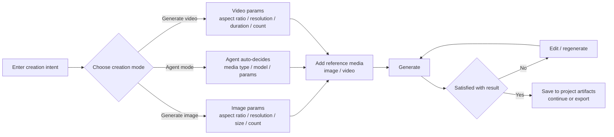

<h1 align="center">
  <br>
  <picture>
    <source media="(prefers-color-scheme: light)" srcset="frontend/public/matrixspooll-mark.svg">
    <source media="(prefers-color-scheme: dark)" srcset="frontend/public/matrixspooll-mark.svg">
    
  </picture>
  <br>
  MatrixSpooll
  <br>
</h1>

<p align="center">
  <strong>An open-source, self-hosted AI video production workspace</strong>
  <br>
  Turn novels, finished screenplays, or product assets into character-consistent, controllable, cost-trackable short videos that remain editable.
</p>

<p align="center">
  <a href="README.md"></a>
  <a href="README.en.md"></a>
</p>

<p align="center">
  <a href="LICENSE"></a>
  <a href="NOTICE"></a>
</p>

<p align="center">
  <a href="#quick-start"><strong>Quick Start</strong></a>
  ·
  <a href="website/docs/guide/getting-started.md">Getting Started</a>
  ·
  <a href="website/docs/index.mdx">Documentation</a>
</p>

<p align="center">
  
</p>

## Capabilities added over ArcReel

MatrixSpooll is a derivative of [ArcReel](https://github.com/ArcReel/ArcReel) (upstream repository: <https://github.com/ArcReel/ArcReel>). Compared with the upstream, this project adds:

- **Multi-user & permissions**: account management, role hierarchy, project members and ownership transfer, plus audit logs, login events, and online session management;
- **Admin console**: administrators manage accounts, online sessions, login logs, and generation tasks;
- **Free-creation canvas**: direct creation outside the fixed workflow, with three modes (Generate image / Agent mode / Generate video), two reference modes (all-in-one reference / first-last frames), and creation tools such as storyboard planning, voice-over, subtitles, and video merging;
- **Generation parameters**: visual configuration of aspect ratio, resolution, size, duration, and generation count, auto-decided in Agent mode;
- **Production storage & deployment**: PostgreSQL storage, Docker Compose production deployment, SQLite migration, and project archive import/export;
- **Observability & compliance**: generation cost estimation and usage tracking, plus a source download entry for authorized users.

## Free creation flow

Free creation needs no source file, script, episode plan, or fixed generation mode. A single submission of "text + reference media + output intent" directly produces images or videos, which you can then edit, compare, and reuse:



## Screenshots

**Home**: from input to recent projects and generation results.


**Admin console**: unified management of accounts, sessions, login logs, and generation tasks.


**Free-creation canvas**: what you type is what you get — generate and iterate on images and videos directly.


## Quick Start

Install Docker and Docker Compose, then run:

```bash
# Extract the delivered complete source package on the customer server first.
cd /srv/matrixspooll/deploy/production

cp .env.example .env
# Set authentication, PostgreSQL, PUBLIC_HOST, PUBLIC_ORIGIN, and CERTBOT_EMAIL
docker compose -f docker-compose.yml up -d --build
```

Point the `PUBLIC_HOST` domain or public IPv4 address to the server and allow TCP ports `80` and `443` through the firewall. After certificate issuance, open `https://<PUBLIC_HOST>`. The default administrator username is `admin`; deployment settings live in `deploy/production/.env`.

> Production Compose uses Nginx as the only public entry point. Application port `1241` and PostgreSQL port `5432` remain inside Docker networks. Certbot obtains and renews certificates for a domain or public IPv4 address. See [Deployment and Operations](website/docs/ops/deployment.md) for prerequisites.

After signing in as an administrator, open **Settings**, configure the MatrixSpooll AI assistant and the required text, image, and video capabilities, then create other accounts and projects as needed. Regular users only see entries allowed by their permissions.

For the complete first-run workflow, see [Getting Started](website/docs/guide/getting-started.md). For production deployment, upgrades, backups, and reverse proxies, see [Deployment and Operations](website/docs/ops/deployment.md).

## Documentation

| Page | Purpose |
|---|---|
| [Documentation Home](website/docs/index.mdx) | Entry points for users, operators, and developers |
| [Getting Started](website/docs/guide/getting-started.md) | From first deployment to the first generated video |
| [Workflows and Modes](website/docs/guide/workflows.md) | Fixed-workflow content modes, free creation, and the two video generation routes |
| [Provider Configuration](website/docs/guide/providers.md) | Selection and configuration of Agent, text, image, video, and TTS providers |
| [Jianying Draft Export](website/docs/guide/jianying-export.md) | Continue editing MatrixSpooll output in Jianying |
| [FAQ](website/docs/guide/faq.md) | Deployment, cost, model, data, and licensing questions |
| [Deployment and Operations](website/docs/ops/deployment.md) | PostgreSQL, upgrades, backups, and reverse proxies |
| [Migrate from SQLite to PostgreSQL](website/docs/ops/migrate-to-postgres.md) | SQLite to PostgreSQL migration, verification, and rollback |
| [Architecture](website/docs/dev/architecture.md) | Agent Runtime, task queue, provider abstraction, and data layer |
| [Contributing](website/docs/dev/contributing.md) | Local development, tests, conventions, and pull requests |


## Contributing

The delivered source package is the basis for customer maintenance, customization, and reproducible problem reports.

Read [CONTRIBUTING.md](CONTRIBUTING.md) before maintenance work. In the source working directory, install the pre-commit hooks:

```bash
uv run pre-commit install
```

## License

This project is released under the [GNU Affero General Public License v3.0](LICENSE), with the attribution and modification-notice requirements in [NOTICE](NOTICE). The software is provided without warranty; users may use, modify, and redistribute it under AGPL-3.0.

This delivered version is a modified version of [ArcReel](https://github.com/ArcReel/ArcReel). It adds MatrixSpooll multi-user access, free creation, stable project identity, and PostgreSQL deployment support, and is clearly distinguished from the upstream release. The complete corresponding source is included with the delivery package; the deployment operator must provide network users with a controlled way to obtain it from the running system.

Users remain responsible for ensuring that input assets and generated content comply with applicable law, contracts, copyright, personality and privacy rights, and provider policies. Do not use this software to evade content safeguards or create unlawful, infringing, deceptive, or otherwise harmful material. See [DISCLAIMER.en.md](DISCLAIMER.en.md). This notice does not restrict rights granted by AGPL-3.0.

MatrixSpooll Copyright © 2026 AtaraxyEcho.
