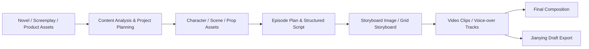

<h1 align="center">
  <br>
  <picture>
    <source media="(prefers-color-scheme: light)" srcset="frontend/public/matrixspooll-mark.svg">
    <source media="(prefers-color-scheme: dark)" srcset="frontend/public/matrixspooll-mark.svg">
    
  </picture>
  <br>
  MatrixSpooll
  <br>
</h1>

<p align="center">
  <strong>An open-source, self-hosted AI video production workspace</strong>
  <br>
  Turn novels, finished screenplays, or product assets into character-consistent, controllable, cost-trackable short videos that remain editable.
</p>

<p align="center">
  <a href="README.md"></a>
  <a href="README.en.md"></a>
</p>

<p align="center">
  <a href="https://github.com/MockMine/MatrixSpooll/releases/latest"></a>
  <a href="https://github.com/MockMine/MatrixSpooll/actions/workflows/test.yml"></a>
  <a href="https://codecov.io/gh/MockMine/MatrixSpooll"></a>
  <a href="LICENSE"></a>
  <a href="https://github.com/MockMine/MatrixSpooll"></a>
</p>

<p align="center">
  <a href="#quick-start"><strong>Quick Start</strong></a>
  ·
  <a href="website/docs/guide/getting-started.md">Getting Started</a>
  ·
  <a href="website/docs/index.mdx">Documentation</a>
  ·
  <a href="#community">Community</a>
</p>

<p align="center">
  
</p>

## What MatrixSpooll is

MatrixSpooll is an open-source, self-hosted workspace for AI drama and novel adaptation, narrated short videos, ads, product shorts, and free creation. It organizes content analysis, asset management, storyboards, media generation, cost tracking, and export into inspectable and resumable workflows, while also supporting direct image and video generation outside the fixed workflow.

- **One production workflow**: turn novels, finished screenplays, or product assets into characters, scenes, props, storyboards, video clips, and final videos step by step.
- **Visual continuity with human control**: reuse reference assets across shots, review key stages, regenerate individual assets, and roll back to earlier versions.
- **Manageable models and costs**: configure text, image, video, and TTS capabilities in one place, then review estimated costs and actual usage.
- **Editable delivery**: render final videos directly or export Jianying drafts to refine subtitles, voice-over, pacing, and transitions. Exports target the mainland-China edition of Jianying; CapCut compatibility has not been verified.

## From source to final video



Every stage can be orchestrated by the AI assistant, or reviewed, adjusted, and regenerated by the user in the workspace. See [Workflows and Modes](website/docs/guide/workflows.md) for guidance on choosing a mode.

## Quick Start

Install Docker and Docker Compose, then run:

```bash
git clone https://github.com/MockMine/MatrixSpooll.git
cd MatrixSpooll/deploy

cp .env.example .env
docker compose up -d
```

Open <http://localhost:1241>. The default username is `admin`. If `AUTH_PASSWORD` is empty, MatrixSpooll generates a password on first startup and writes it back to `deploy/.env`.

> Default Compose publishes port `1241` on all host interfaces. Do not expose MatrixSpooll directly to the public Internet; before enabling remote access, configure authentication and use HTTPS, a VPN, or a secure tunnel. See [Reverse Proxy and HTTPS](website/docs/ops/deployment.md).

After signing in, open **Settings**, configure the MatrixSpooll AI assistant and the required text, image, and video generation capabilities, then create a project.

For the complete first-run workflow, see [Getting Started](website/docs/guide/getting-started.md). For production deployment, upgrades, backups, and reverse proxies, see [Deployment and Operations](website/docs/ops/deployment.md).

## Documentation

| Page | Purpose |
|---|---|
| [Documentation Home](website/docs/index.mdx) | Entry points for users, operators, and developers |
| [Getting Started](website/docs/guide/getting-started.md) | From first deployment to the first generated video |
| [Workflows and Modes](website/docs/guide/workflows.md) | Fixed-workflow content modes, free creation, and the two video generation routes |
| [Provider Configuration](website/docs/guide/providers.md) | Selection and configuration of Agent, text, image, video, and TTS providers |
| [Jianying Draft Export](website/docs/guide/jianying-export.md) | Continue editing MatrixSpooll output in Jianying |
| [FAQ](website/docs/guide/faq.md) | Deployment, cost, model, data, and licensing questions |
| [Deployment and Operations](website/docs/ops/deployment.md) | PostgreSQL, upgrades, backups, and reverse proxies |
| [Migrate from SQLite to PostgreSQL](website/docs/ops/migrate-to-postgres.md) | SQLite to PostgreSQL migration, verification, and rollback |
| [Architecture](website/docs/dev/architecture.md) | Agent Runtime, task queue, provider abstraction, and data layer |
| [Contributing](website/docs/dev/contributing.md) | Local development, tests, conventions, and pull requests |


## Contributing

Contributions to code, documentation, tests, provider adapters, and reproducible bug reports are welcome.

Read [CONTRIBUTING.md](CONTRIBUTING.md) before starting. After cloning the repository, install the pre-commit hooks:

```bash
uv run pre-commit install
```

## License

This project is released under the [GNU Affero General Public License v3.0](LICENSE), with the attribution and modification-notice requirements in [NOTICE](NOTICE). The software is provided without warranty; users may use, modify, and redistribute it under AGPL-3.0.

This repository is a modified version of the upstream project. It adds MatrixSpooll multi-user access, free creation, stable project identity, and PostgreSQL deployment support, and is clearly distinguished from the upstream release.

Current source: <https://github.com/MockMine/MatrixSpooll>

MatrixSpooll Copyright © 2026 MatrixSpooll contributors.
