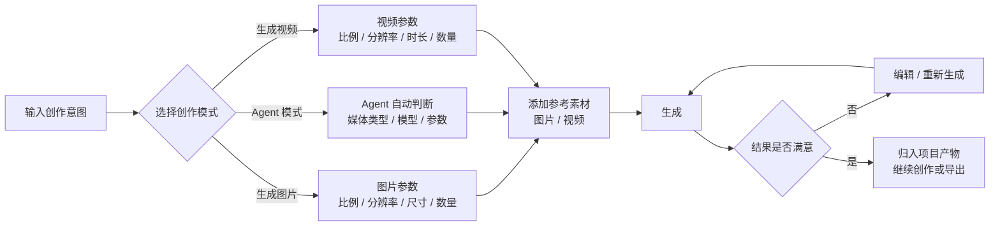
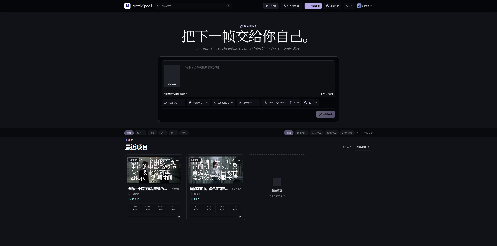
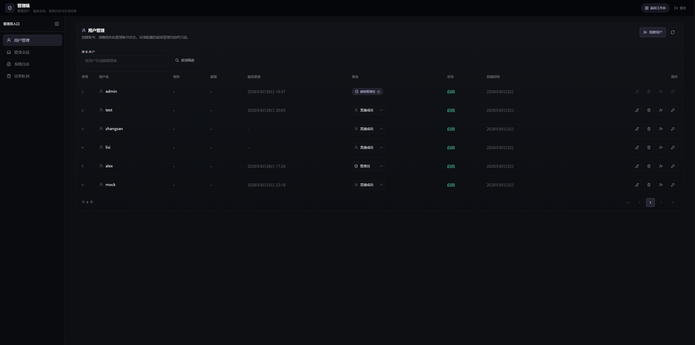
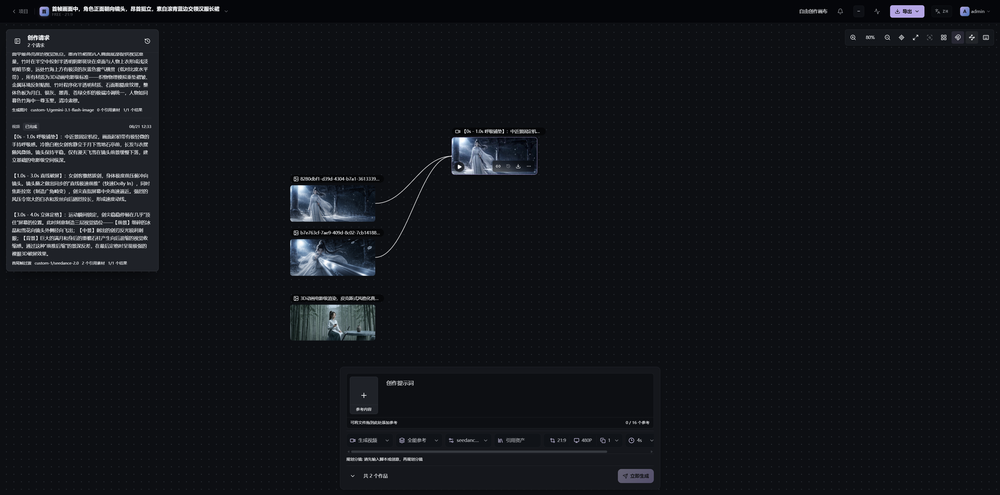

<h1 align="center">
  <br>
  <picture>
    <source media="(prefers-color-scheme: light)" srcset="frontend/public/matrixspooll-mark.svg">
    <source media="(prefers-color-scheme: dark)" srcset="frontend/public/matrixspooll-mark.svg">
    
  </picture>
  <br>
  MatrixSpooll
  <br>
</h1>

<p align="center">
  <strong>开源、自托管的 AI 视频生产工作台</strong>
  <br>
  将小说、成品剧本或商品素材转化为角色一致、过程可控、成本可追踪、可继续编辑的短视频。
</p>

<p align="center">
  <a href="README.md"></a>
  <a href="README.en.md"></a>
</p>

<p align="center">
  <a href="LICENSE"></a>
  <a href="NOTICE"></a>
</p>

<p align="center">
  <a href="#快速开始"><strong>快速开始</strong></a>
  ·
  <a href="website/docs/guide/getting-started.md">入门教程</a>
  ·
  <a href="website/docs/index.mdx">完整文档</a>
</p>

## 相对 ArcReel 新增的能力

MatrixSpooll 是基于 [ArcReel](https://github.com/ArcReel/ArcReel) 二次开发的项目（原项目仓库：<https://github.com/ArcReel/ArcReel>）。相对上游，本项目新增的能力包括：

- **多用户与权限**：账号管理、角色权限层级、项目成员与所有权转移，以及审计日志、登录事件与在线会话管理；
- **管理端**：管理员统一管理账号、在线会话、登录日志与生成任务；
- **自由创作画布**：不经过固定工作流的直接创作，支持「生成图片 / Agent 模式 / 生成视频」三种模式与「全能参考 / 首尾帧」参考方式，并提供规划分镜、添加配音、添加字幕、合并视频等创作工具；
- **生成参数**：画面比例、分辨率、尺寸、时长与生成数量的可视化配置，Agent 模式可自动判断；
- **生产级存储与部署**：PostgreSQL 存储、Docker Compose 生产部署、SQLite 迁移，以及项目归档的导入导出；
- **可观测与合规**：生成费用估算与用量追踪，以及面向授权用户的源码获取入口。

## 自由创作流程

自由创作不要求源文件、脚本、分集或固定生成模式。一次提交「文本 + 参考素材 + 输出意图」即可直接生成图片或视频，并对结果持续编辑、比较和复用：



## 界面预览

**主页**：从输入开始，集中最近项目与生成结果。



**管理端**：账号、会话、登录日志与生成任务的统一管理。



**自由创作画布**：输入即所得，直接生成并持续迭代图片与视频。



## 快速开始

准备好 Docker 和 Docker Compose，然后运行：

```bash
# 将交付的完整源码包解压到客户服务器后进入该目录
cd /srv/matrixspooll/deploy/production

cp .env.example .env
# 编辑 .env，至少设置认证、PostgreSQL、PUBLIC_HOST、PUBLIC_ORIGIN 和 CERTBOT_EMAIL
docker compose -f docker-compose.yml up -d --build
```

将 `PUBLIC_HOST` 的域名或公网 IPv4 指向服务器，并确保防火墙放行 TCP `80`、`443`。证书签发完成后，通过 `https://<PUBLIC_HOST>` 访问；默认管理员用户名为 `admin`，配置文件位于 `deploy/production/.env`。

> 生产 Compose 由 Nginx 作为唯一公网入口，应用 `1241` 和 PostgreSQL `5432` 只在 Docker 网络内可达。Certbot 会申请并续期域名或公网 IPv4 证书。部署细节与证书前提见[部署与运维](website/docs/ops/deployment.md)。

管理员登录后进入 **设置** 页面，配置 MatrixSpooll AI 助手以及文本、图像、视频等生成能力，再按需要创建其他账号和项目。普通用户只会看到其权限允许的入口。

完整的首次使用流程见[完整入门教程](website/docs/guide/getting-started.md)；生产部署、升级、备份和反向代理见[部署与运维](website/docs/ops/deployment.md)。

## 文档

| 页面 | 内容 |
|---|---|
| [文档首页](website/docs/index.mdx) | 按使用者、运维者和开发者进入文档 |
| [完整入门教程](website/docs/guide/getting-started.md) | 从首次部署到生成第一条视频 |
| [创作流程与模式](website/docs/guide/workflows.md) | 固定工作流内容模式、自由创作以及两种视频生成路线 |
| [供应商与模型配置](website/docs/guide/providers.md) | Agent、文本、图像、视频、TTS 供应商的选择和配置 |
| [剪映草稿导出](website/docs/guide/jianying-export.md) | 将 MatrixSpooll 生成结果交给剪映继续编辑 |
| [常见问题](website/docs/guide/faq.md) | 部署、费用、模型、数据和许可证问题 |
| [部署与运维](website/docs/ops/deployment.md) | PostgreSQL 单库、升级、备份和反向代理 |
| [从 SQLite 迁移到 PostgreSQL](website/docs/ops/migrate-to-postgres.md) | 数据迁移、验证与回滚流程 |
| [架构说明](website/docs/dev/architecture.md) | Agent Runtime、任务队列、供应商抽象和数据层 |
| [贡献指南](website/docs/dev/contributing.md) | 本地开发、测试、代码规范和 PR 流程 |

## 贡献

交付源码包可作为客户后续维护、定制开发和问题复现的基础。

开始维护前请阅读 [CONTRIBUTING.md](CONTRIBUTING.md)。在源码工作目录中建议立即安装项目的 pre-commit 钩子：

```bash
uv run pre-commit install
```

## 许可证

本项目整体按 [GNU Affero General Public License v3.0](LICENSE) 发布，附加署名和修改声明要求见 [NOTICE](NOTICE)。软件不提供任何担保；用户可以依照 AGPL-3.0 使用、修改和再分发本项目。

本交付版本基于 [ArcReel](https://github.com/ArcReel/ArcReel) 修改，已加入 MatrixSpooll 的多用户、自由创作、项目身份和 PostgreSQL 部署能力；修改后的版本与上游项目保持清晰区分。完整对应源码随交付包提供；部署方应在实际运行系统中向网络用户提供受控的源码获取入口。

使用者应自行确认输入素材与生成内容符合适用法律、合同、著作权、肖像权、隐私权和模型供应商政策。不得依赖本软件规避内容审核或制作违法、侵权、欺诈及其他有害内容；完整说明见 [DISCLAIMER.md](DISCLAIMER.md)。该说明不改变 AGPL-3.0 授予的权利。

MatrixSpooll Copyright © 2026 AtaraxyEcho.
