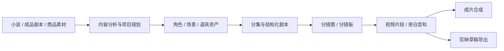

<h1 align="center">
  <br>
  <picture>
    <source media="(prefers-color-scheme: light)" srcset="frontend/public/matrixspooll-mark.svg">
    <source media="(prefers-color-scheme: dark)" srcset="frontend/public/matrixspooll-mark.svg">
    
  </picture>
  <br>
  MatrixSpooll
  <br>
</h1>

<p align="center">
  <strong>开源、自托管的 AI 视频生产工作台</strong>
  <br>
  将小说、成品剧本或商品素材转化为角色一致、过程可控、成本可追踪、可继续编辑的短视频。
</p>

<p align="center">
  <a href="README.md"></a>
  <a href="README.en.md"></a>
</p>

<p align="center">
  <a href="https://github.com/MockMine/MatrixSpooll/releases/latest"></a>
  <a href="https://github.com/MockMine/MatrixSpooll/actions/workflows/test.yml"></a>
  <a href="https://codecov.io/gh/MockMine/MatrixSpooll"></a>
  <a href="LICENSE"></a>
  <a href="https://github.com/MockMine/MatrixSpooll"></a>
</p>

<p align="center">
  <a href="#快速开始"><strong>快速开始</strong></a>
  ·
  <a href="website/docs/guide/getting-started.md">入门教程</a>
  ·
  <a href="website/docs/index.mdx">完整文档</a>
  ·
  <a href="#交流群">加入社区</a>
</p>

<p align="center">
  
</p>

## MatrixSpooll 是什么

MatrixSpooll 是面向 AI 漫剧与小说改编、说书与旁白短视频、广告与带货短片及自由创作的开源自托管工作台。它把内容分析、资产管理、分镜、媒体生成、费用追踪和导出组织成可审核、可中断恢复的生产流程，同时支持不经过固定工作流的直接图片与视频生成。

- **统一生产链路**：小说、成品剧本或商品素材都能逐步转化为角色、场景、道具、分镜、视频片段和最终成片。
- **视觉一致、人工可控**：跨镜头复用参考资产，关键阶段可审核，单个素材可重做，历史版本可回滚。
- **模型与成本可管理**：统一配置文本、图像、视频和 TTS 能力，并在生成前后查看费用与实际用量。
- **交付可继续编辑**：既可直接合成视频，也可导出剪映草稿继续调整字幕、配音、节奏和转场。导出面向中国大陆版剪映，与 CapCut 的兼容性尚未验证。

## 从输入到成片



每个阶段都可以由 AI 助手编排，也可以由用户在工作台中审核、调整或重新生成。详细模式选择见 [创作流程与模式](website/docs/guide/workflows.md)。

## 快速开始

准备好 Docker 和 Docker Compose，然后运行：

```bash
git clone https://github.com/MockMine/MatrixSpooll.git
cd MatrixSpooll/deploy/production

cp .env.example .env
# 编辑 .env，至少设置 POSTGRES_PASSWORD 和认证配置
docker compose -f docker-compose.yml up -d --build
```

访问 <http://localhost:1241>。默认用户名为 `admin`；配置文件位于 `deploy/production/.env`。

> 默认 Compose 会将 `1241` 端口发布到宿主机所有网络接口。请勿将服务直接暴露到公网；远程访问前请配置认证，并使用 HTTPS、VPN 或安全隧道，详见[反向代理与 HTTPS](website/docs/ops/deployment.md)。

登录后进入 **设置** 页面，配置 MatrixSpooll AI 助手以及文本、图像、视频等生成能力，再创建项目开始制作。

完整的首次使用流程见[完整入门教程](website/docs/guide/getting-started.md)；生产部署、升级、备份和反向代理见[部署与运维](website/docs/ops/deployment.md)。

## 文档

| 页面 | 内容 |
|---|---|
| [文档首页](website/docs/index.mdx) | 按使用者、运维者和开发者进入文档 |
| [完整入门教程](website/docs/guide/getting-started.md) | 从首次部署到生成第一条视频 |
| [创作流程与模式](website/docs/guide/workflows.md) | 固定工作流内容模式、自由创作以及两种视频生成路线 |
| [供应商与模型配置](website/docs/guide/providers.md) | Agent、文本、图像、视频、TTS 供应商的选择和配置 |
| [剪映草稿导出](website/docs/guide/jianying-export.md) | 将 MatrixSpooll 生成结果交给剪映继续编辑 |
| [常见问题](website/docs/guide/faq.md) | 部署、费用、模型、数据和许可证问题 |
| [部署与运维](website/docs/ops/deployment.md) | PostgreSQL 单库、升级、备份和反向代理 |
| [从 SQLite 迁移到 PostgreSQL](website/docs/ops/migrate-to-postgres.md) | 数据迁移、验证与回滚流程 |
| [架构说明](website/docs/dev/architecture.md) | Agent Runtime、任务队列、供应商抽象和数据层 |
| [贡献指南](website/docs/dev/contributing.md) | 本地开发、测试、代码规范和 PR 流程 |

## 贡献

欢迎贡献代码、文档、测试、供应商适配和问题复现。

开始开发前请阅读 [CONTRIBUTING.md](CONTRIBUTING.md)。本地克隆后建议立即安装项目的 pre-commit 钩子：

```bash
uv run pre-commit install
```

## 许可证

本项目整体按 [GNU Affero General Public License v3.0](LICENSE) 发布，附加署名和修改声明要求见 [NOTICE](NOTICE)。软件不提供任何担保；用户可以依照 AGPL-3.0 使用、修改和再分发本项目。

本仓库是基于上游项目的修改版本，已加入 MatrixSpooll 的多用户、自由创作、项目身份和 PostgreSQL 部署能力；修改后的版本与上游项目保持清晰区分。

当前版本源码：<https://github.com/MockMine/MatrixSpooll>

MatrixSpooll Copyright © 2026 MatrixSpooll contributors.
